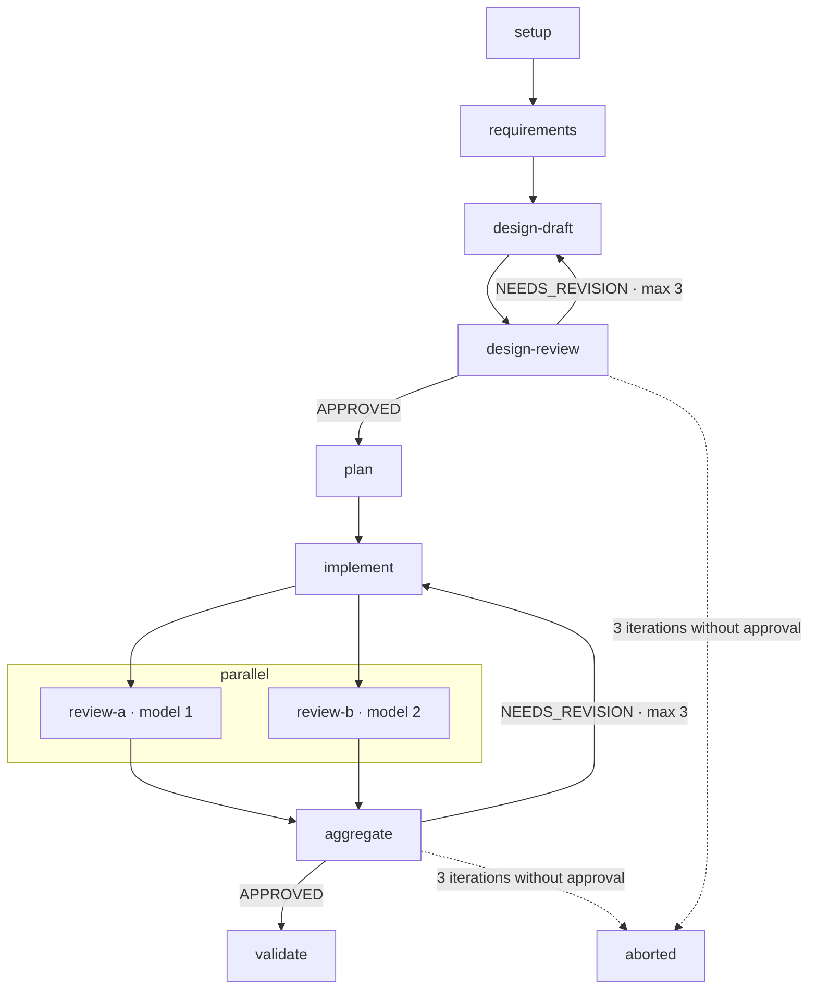

# feature-pipeline (DSH workflow recipe)

The same pipeline as Kiro's `feature-pipeline`, built for DSH's `workflow` tool.

```
setup → scoped analysis (the area being changed only) → decision brief
  ├─ needs your decision → stops (needs_decision) + resume
  ├─ already satisfied / not recommended → ends (ended) with no changes
  └─ nothing needs you → continues straight on
requirements → design-loop (max 3) → plan
  → code-loop (max 3): implement → parallel(reviewers…) → aggregate
  → validate
```

- Each step is a separate agent with fresh context. A reviewer never sees the implementer's reasoning.
- The stop condition is deterministic: the `verdict` field in the schema is `APPROVED` or `NEEDS_REVISION`.
- If a loop reaches its limit without approval, the run stops with `status: "aborted"` (unless `abortIfUnapproved: false`).
- Each reviewer can run on a different model through `provider`/`model`, for real multi-model review.

## Usage

Ask DSH:

> Run the workflow from `~/Desktop/dsh-recipes/feature-pipeline` (meta = meta.json, script = script.js) with args: {...}

`args`:

| Field | Required | Description |
|---|---|---|
| `task` | ✓ | Description of the feature |
| `repo` | ✓ | Absolute path of the repository |
| `maxDesignIterations` / `maxCodeIterations` | | Default 3 |
| `reviewers` | | `[{label, provider?, model?}]`; default is two reviewers |
| `implementer` | | `{provider?, model?}` |
| `abortIfUnapproved` | | Default `true` |
| `decisions` | | Your answers to the brief `{id: answer}` |
| `resume` | | Taken from a previous result to continue without repeating the analysis |

Example:

```json
{
  "task": "Add rate limiting to /api/login: 5 attempts per minute per IP",
  "repo": "/Users/tariq/Projects/my-app",
  "reviewers": [
    { "label": "review-claude", "provider": "anthropic", "model": "claude-opus-5-5" },
    { "label": "review-other",  "provider": "deepseek",  "model": "deepseek-chat" }
  ]
}
```

> Use `list_subagent_models` to get the real provider/model names allowed in your settings.

## Scoped analysis and the decision brief

**Scoped analysis:** it does not analyse the whole project. It covers only:
- the files and functions the request names or implies,
- their direct callers (one hop),
- the tests that cover them.

It returns: the current state (with `file:line` evidence), what is missing, and an outcome: `proceed`, `already_satisfied` or `not_recommended`.

**Decision brief:** every decision comes in one batch, and each one includes:
- `current`: what the code does today
- `options`: each option with its concrete consequence
- `recommendation` and `why`

| Type | Behavior |
|---|---|
| `needs_user`: adds a feature, changes behavior, or touches a contract, deletion, security or scope | Stops and asks you |
| `auto`: everything else, including rare edge cases nothing depends on | Decided for you and shown in `decidedForYou` so you can override it |

**Continuing:** re-run with `resume` (from the previous result) plus your answers. Setup and the analysis are not repeated:

```json
{ "task": "...", "repo": "...", "resume": { ...from the result... }, "decisions": { "null-input": "return ''" } }
```

**After the brief:**
- `high_risk` (security, deletion, a contract other code depends on): always stops.
- `follow_up` (a branch opened by your own choice): allowed in **one** extra round only.
- anything else: decided and recorded in `assumptions`.

Every result includes `reviewTrail` (each review and its verdict), including `aborted` results.

## The review verdict is decided in code

- If **any** reviewer returns `NEEDS_REVISION`, the result is `NEEDS_REVISION`, even if the aggregator approves. The aggregator only merges findings. (A real test showed the aggregator approving code that both reviewers had rejected; this rule closes that gap.)
- Reviewers treat any violation of an acceptance criterion or a recorded decision as `high` at minimum, even if the tests pass.

## Testing the repair loop: `faultInjection` (testing only)

```json
{ "faultInjection": { "keepTestsGreen": true } }
```

After the first implementation, an extra agent plants one subtle bug that violates an acceptance criterion while the tests still pass. Reviewers are not told. The result includes `injectedFault` so you can confirm the bug was caught and fixed. **Off by default; do not use it on real work.**

## Speedups (0.3.0)

| Argument | Default | Behavior |
|---|---|---|
| `fastPath` | `true` | One or two concrete scoped files (no directories, globs, `.` or `..`), no needs_user decisions (even answered ones), and no open/pending decisions: one medium `quick-spec` returns acceptance, verifyCommands and plan. Requirements/design-loop/plan agents are skipped. |
| `earlyValidate` | `true` | Validate in parallel with reviewers after each implementation; discard on rejection, reuse on approval. |
| `useAggregator` | `false` | Merge reviewer findings deterministically without an aggregate agent. Optional aggregate cannot erase rejection/blocker evidence. |
| `stepTimeoutMs` | Role defaults | Positive milliseconds or map by label/role. setup 3m, analysis 6m, quick-spec/requirements/plan 5m, design/designReview 6m, implementer 20m, reviewer 10m, validate 8m. |
| `cachedSetup` | Internal | Validated `{stack,testCommands,lintCommands,conventions}`; skips setup with a cache-reuse log. |

The fast path intentionally exempts design approval. Results include `fastPath:true` and `designReview: 'skipped (fast path)'`, never "approved". Code approval and exact validate acceptance coverage remain mandatory; the full path still requires design approval. `run_recipe` caches setup for seven days keyed by repository realpath, root manifest contents and recipe name; fresh setup is returned in result/resume. Corrupt/expired entries are ignored.

From iteration two, reviewers verify every prior finding against the changed-path delta and still flag new problems. The recipe itself never runs git commands; delta wording is guidance to independent reviewers.

The installed worker rejects timeoutMs/signal options. The authenticated role marker carries timeoutMs to the private routing provider; its separate enforcement seam must abort/dispose an expired child, penalize the route and retry once using the structured-output policy. Read-only roles retry by default; implementer retry requires `retryImplementer` plus a partial-edits warning. Direct workflow execution cannot enforce these limits without that provider seam. No runtime restart is performed by this change.

Timing reports: `node scripts/flow-report.mjs /path/to/session.jsonl.zstd` from the plugin; plain JSONL is accepted, compressed input needs zstd. The CLI is read-only and only reads the supplied file. Fastest-first model ordering is a captain-owned settings change, not recipe code.

## Note

The recipe does not commit, push or merge. It leaves the changes in the working tree for you to review.

## Graph

The interactive version: `graph/feature-pipeline.html` (source: `graph/feature-pipeline.workflow.json`). These diagrams are historical references from before 0.3.0: they do not depict the quick-spec fast path, default deterministic review union, or concurrent validation. See `script.js` for the current execution order.


